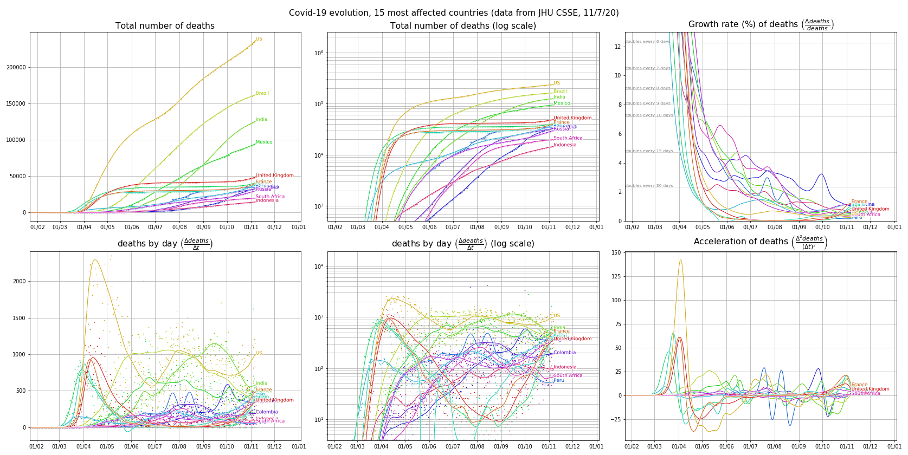
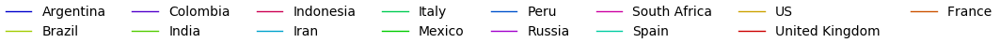
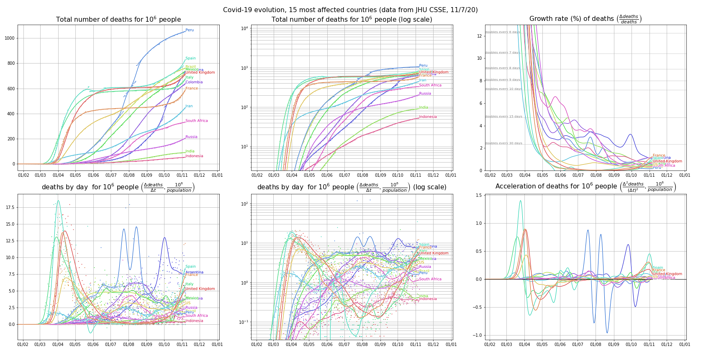
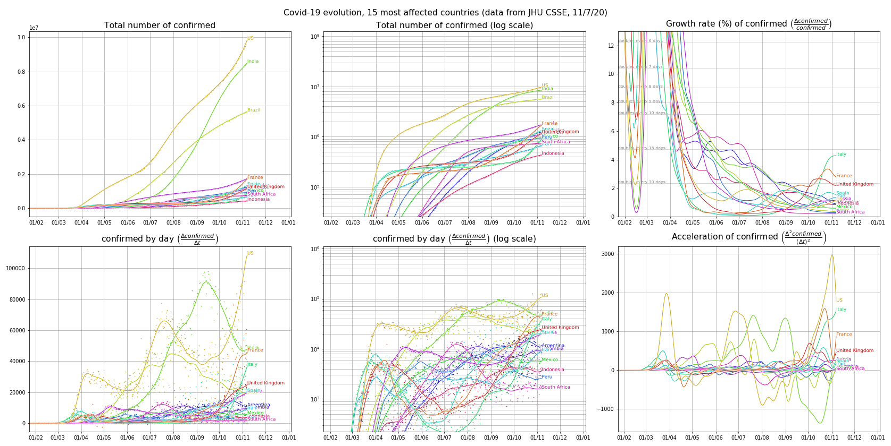
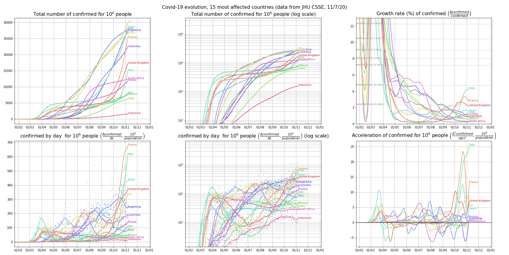
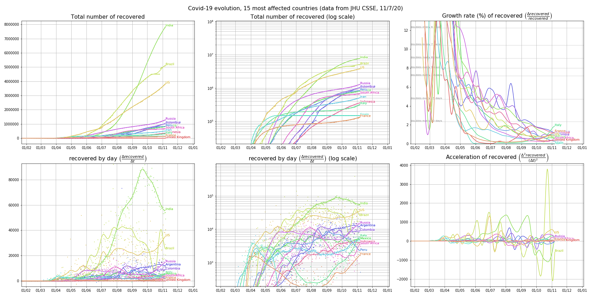
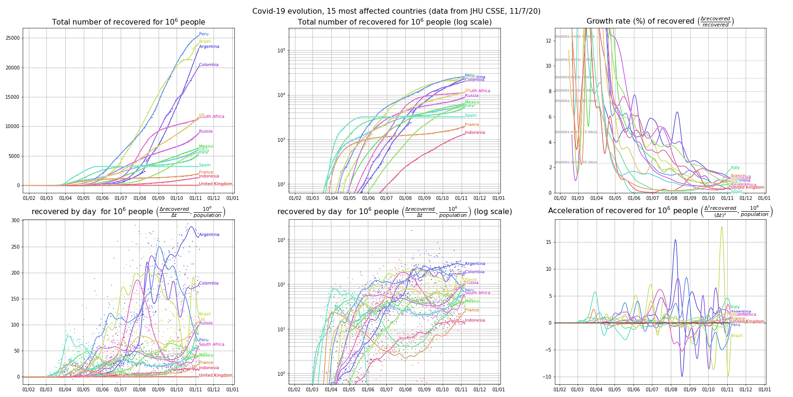

**A page specific to France is [here](../santepubliquefrance/README.html).** 

# Graphical representations of the evolution of COVID-19 <a name="top">

 This page provides graphical representations of [daily-updated data provided by JHU CSSE](https://github.com/CSSEGISandData/COVID-19). It is in particular inspired by this [New York Times article](https://www.nytimes.com/interactive/2020/03/21/upshot/coronavirus-deaths-by-country.html). See also [the site at ourworldingdata.com](https://ourworldindata.org/coronavirus) with many data analyses. 

 We consider the evolution of the number of **deaths**, **confirmed cases** and **recovered cases**. 

 For several groups of countries/regions, we provide graphs of the evolution of the *cumulative value* and the *per-day value* in linear and log scales. We also present evolution curves that are independent of the population size such as the *growth rate*. 

 *High quality pdf files can be obtained by clicking on any graph. This page is generated automatically through a [python script available on Github](https://github.com/brunoscherrer/conarvirus).* 

## Table of contents
-  [World (by continents)](#World)  
-  Continents (by countries) :
	- [Europe](#Europe)  
	- [Asia](#Asia)  
	- [North America](#North_America) ([United States](#United_States) by states)  
	- [South America](#South_America)  
	- [Africa](#Africa)  
	- [Oceania](#Oceania)  
    - [15 countries with the most deaths (in absolute value)](#top15)  

- - - 

## 15 countries with the most deaths<a name="top15"> ([table of contents](#top))

- Deaths: [absolute values](#top15d_abs), [normalized by population size](#top15d_rel)  
- Confirmed cases: [absolute values](#top15c_abs), [normalized by population size](#top15c_rel)  
- Recovered cases: [absolute values](#top15r_abs), [normalized by population size](#top15r_rel)  

### Deaths (absolute values) <a name="top15d_abs"> ([table of contents](#top))

### Deaths (normalized by population size) <a name="top15d_rel"> ([table of contents](#top))

### Confirmed cases (absolute values) <a name="top15c_abs"> ([table of contents](#top))

### Confirmed cases (normalized by population size) <a name="top15c_rel"> ([table of contents](#top))

### Recovered cases (absolute values) <a name="top15r_abs"> ([table of contents](#top))

### Recovered cases (normalized by population size) <a name="top15r_rel"> ([table of contents](#top))

