**A page specific to France is [here](../santepubliquefrance/README.html).** 

# Graphical representations of the evolution of COVID-19 <a name="top">

 This page provides graphical representations of [daily-updated data provided by JHU CSSE](https://github.com/CSSEGISandData/COVID-19). It is in particular inspired by this [New York Times article](https://www.nytimes.com/interactive/2020/03/21/upshot/coronavirus-deaths-by-country.html). See also [the site at ourworldingdata.com](https://ourworldindata.org/coronavirus) with many data analyses. 

 We consider the evolution of the number of **deaths**, **confirmed cases** and **recovered cases**. 

 For several groups of countries/regions, we provide graphs of the evolution of the *cumulative value* and the *per-day value* in linear and log scales. We also present evolution curves that are independent of the population size such as the *growth rate*. 

 *High quality pdf files can be obtained by clicking on any graph. This page is generated automatically through a [python script available on Github](https://github.com/brunoscherrer/conarvirus).* 

## Table of contents
-  [World (by continents)](#World)  
-  Continents (by countries) :
	- [Europe](#Europe)  
	- [Asia](#Asia)  
	- [North America](#North_America) ([United States](#United_States) by states)  
	- [South America](#South_America)  
	- [Africa](#Africa)  
	- [Oceania](#Oceania)  
    - [15 countries with the most deaths (in absolute value)](#top15)  

- - - 

## World<a name="World"> ([table of contents](#top))

- Deaths: [absolute values](#Worldd_abs), [normalized by population size](#Worldd_rel)  
- Confirmed cases: [absolute values](#Worldc_abs), [normalized by population size](#Worldc_rel)  
- Recovered cases: [absolute values](#Worldr_abs), [normalized by population size](#Worldr_rel)  

### Deaths (absolute values) <a name="Worldd_abs"> ([table of contents](#top))

[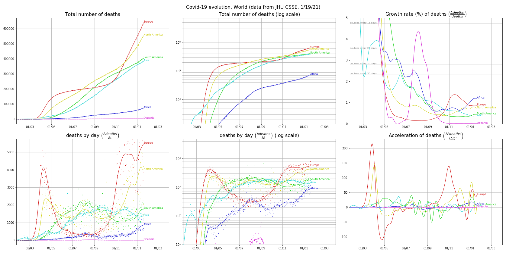](./fig/World_d_a.pdf)

### Deaths (normalized by population size) <a name="Worldd_rel"> ([table of contents](#top))

[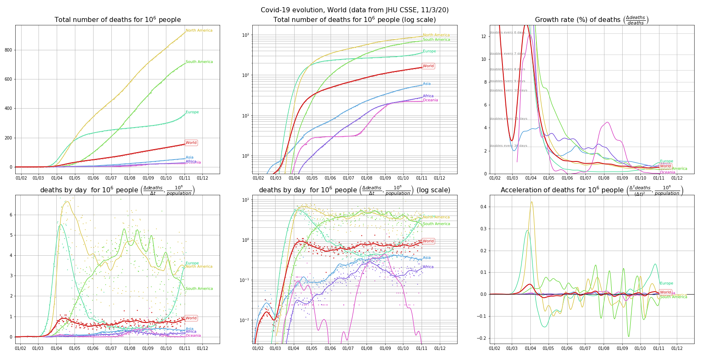](./fig/World_d_b.pdf)

### Confirmed cases (absolute values) <a name="Worldc_abs"> ([table of contents](#top))

[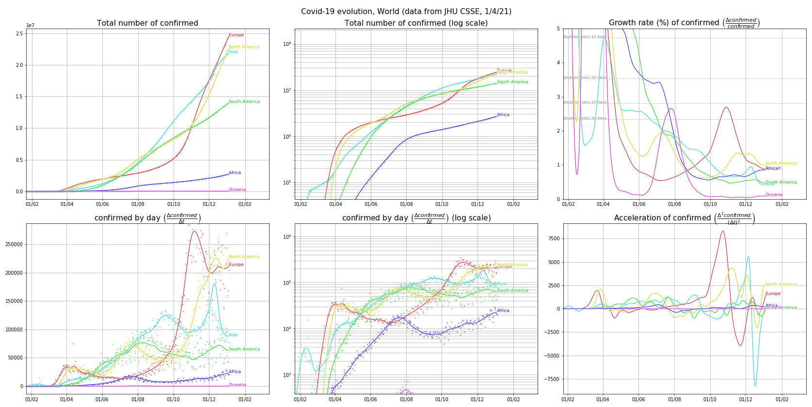](./fig/World_c_a.pdf)

### Confirmed cases (normalized by population size) <a name="Worldc_rel"> ([table of contents](#top))

[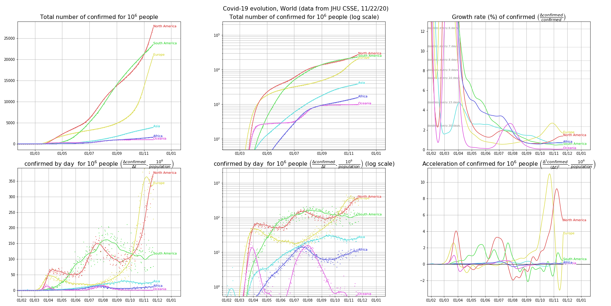](./fig/World_c_b.pdf)

### Recovered cases (absolute values) <a name="Worldr_abs"> ([table of contents](#top))

[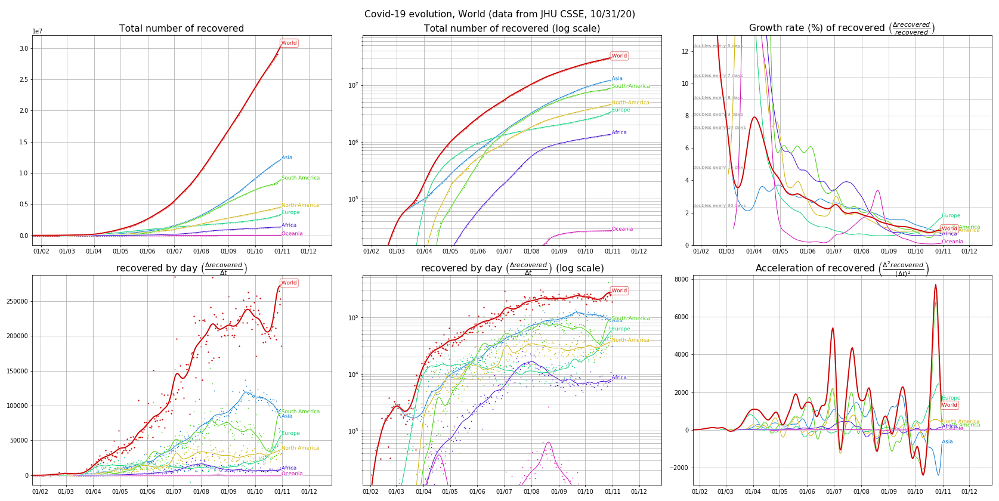](./fig/World_r_a.pdf)

### Recovered cases (normalized by population size) <a name="Worldr_rel"> ([table of contents](#top))

- - - 

## Europe<a name="Europe"> ([table of contents](#top))

- Deaths: [absolute values](#Europed_abs), [normalized by population size](#Europed_rel)  
- Confirmed cases: [absolute values](#Europec_abs), [normalized by population size](#Europec_rel)  
- Recovered cases: [absolute values](#Europer_abs), [normalized by population size](#Europer_rel)  

### Deaths (absolute values) <a name="Europed_abs"> ([table of contents](#top))

[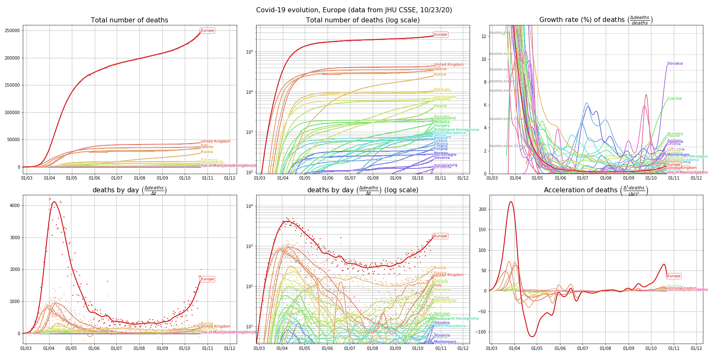](./fig/Europe_d_a.pdf)

### Deaths (normalized by population size) <a name="Europed_rel"> ([table of contents](#top))

[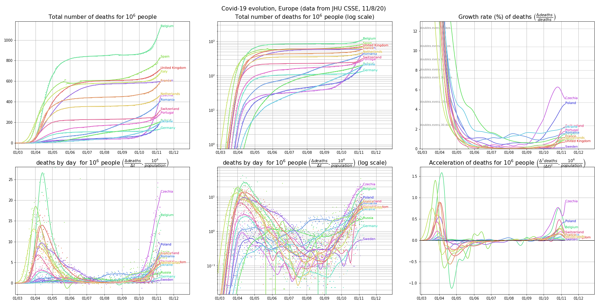](./fig/Europe_d_b.pdf)

### Confirmed cases (absolute values) <a name="Europec_abs"> ([table of contents](#top))

[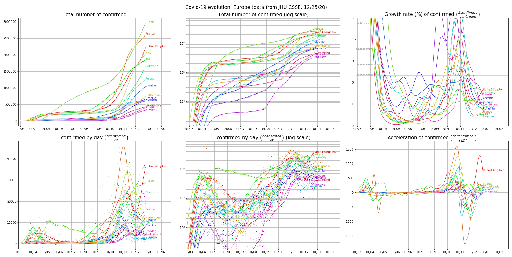](./fig/Europe_c_a.pdf)

### Confirmed cases (normalized by population size) <a name="Europec_rel"> ([table of contents](#top))

[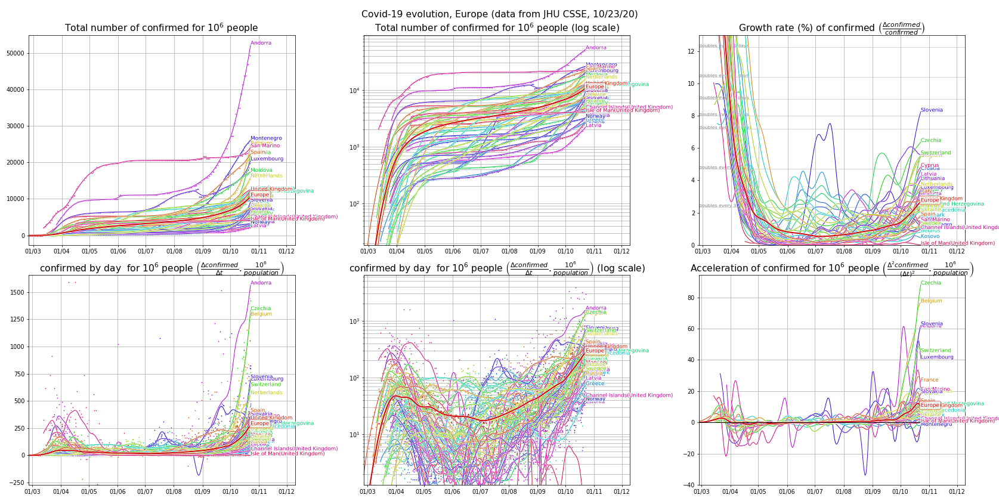](./fig/Europe_c_b.pdf)

### Recovered cases (absolute values) <a name="Europer_abs"> ([table of contents](#top))

[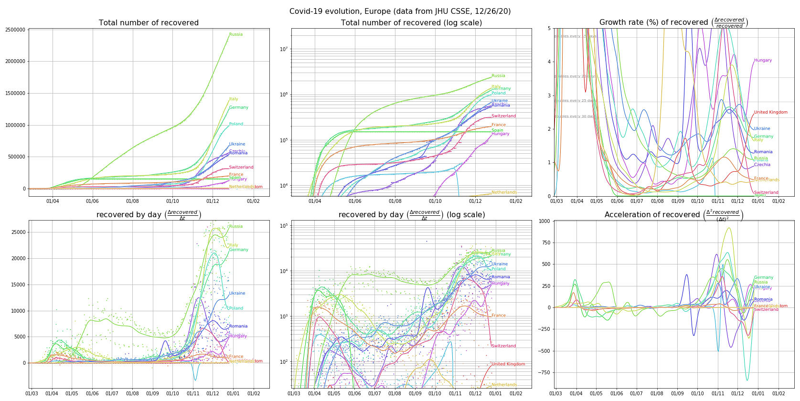](./fig/Europe_r_a.pdf)

### Recovered cases (normalized by population size) <a name="Europer_rel"> ([table of contents](#top))

[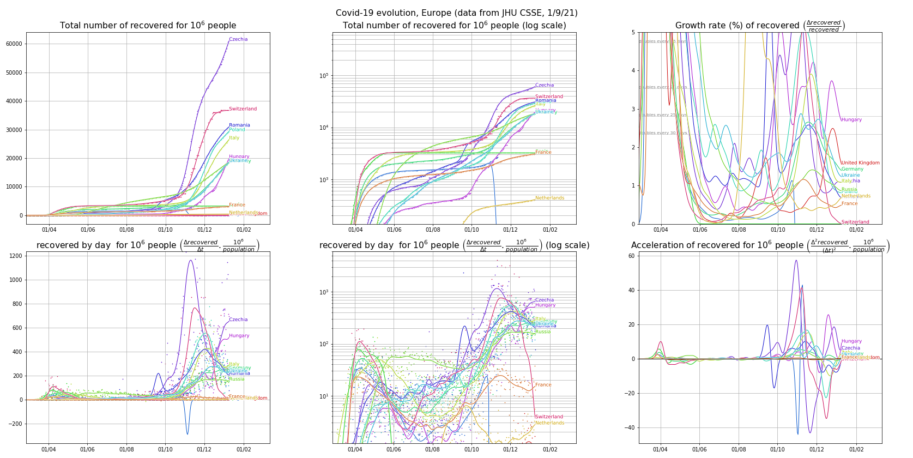](./fig/Europe_r_b.pdf)

- - - 

## Asia<a name="Asia"> ([table of contents](#top))

- Deaths: [absolute values](#Asiad_abs), [normalized by population size](#Asiad_rel)  
- Confirmed cases: [absolute values](#Asiac_abs), [normalized by population size](#Asiac_rel)  
- Recovered cases: [absolute values](#Asiar_abs), [normalized by population size](#Asiar_rel)  

### Deaths (absolute values) <a name="Asiad_abs"> ([table of contents](#top))

[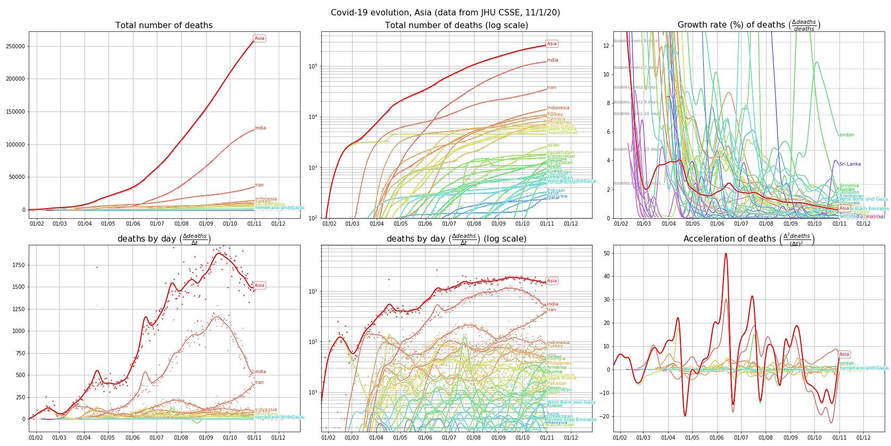](./fig/Asia_d_a.pdf)

[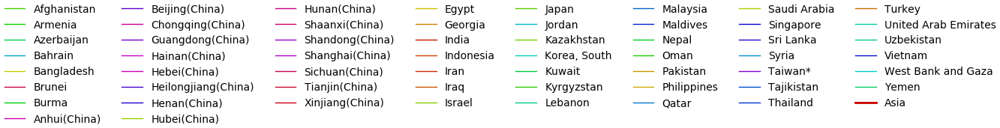](./fig/Asia_legend.pdf)

### Deaths (normalized by population size) <a name="Asiad_rel"> ([table of contents](#top))

### Confirmed cases (absolute values) <a name="Asiac_abs"> ([table of contents](#top))

[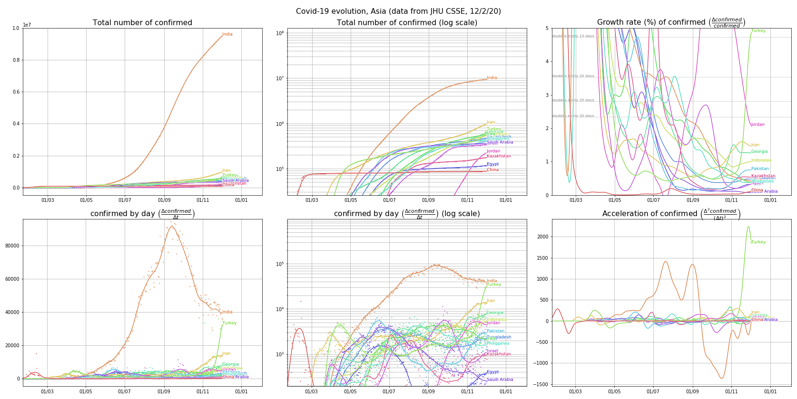](./fig/Asia_c_a.pdf)

### Confirmed cases (normalized by population size) <a name="Asiac_rel"> ([table of contents](#top))

[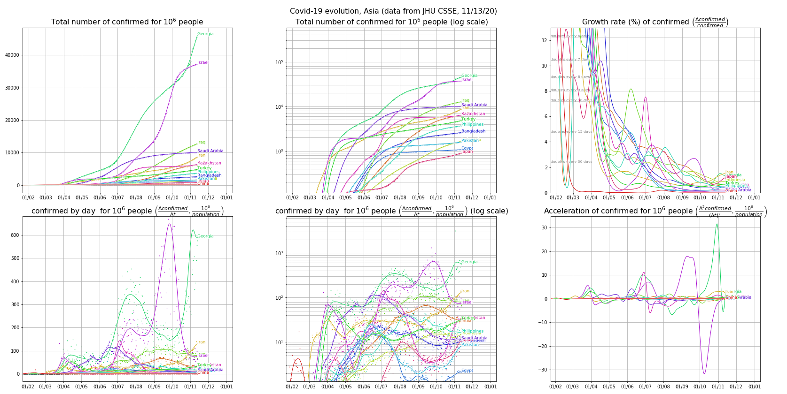](./fig/Asia_c_b.pdf)

### Recovered cases (absolute values) <a name="Asiar_abs"> ([table of contents](#top))

[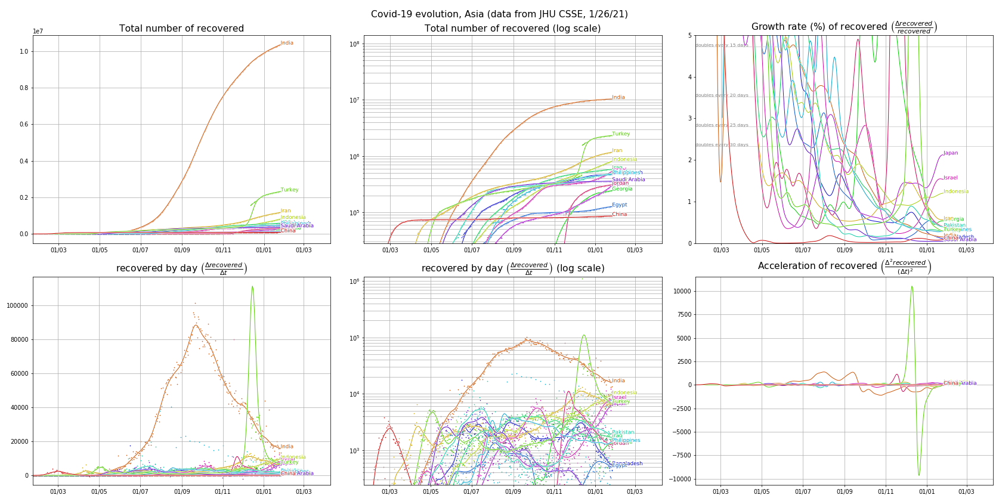](./fig/Asia_r_a.pdf)

### Recovered cases (normalized by population size) <a name="Asiar_rel"> ([table of contents](#top))

[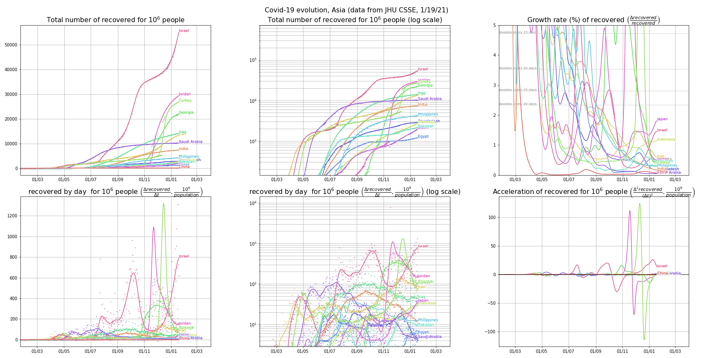](./fig/Asia_r_b.pdf)

- - - 

## North America<a name="North_America"> ([table of contents](#top))

- Deaths: [absolute values](#North_Americad_abs), [normalized by population size](#North_Americad_rel)  
- Confirmed cases: [absolute values](#North_Americac_abs), [normalized by population size](#North_Americac_rel)  
- Recovered cases: [absolute values](#North_Americar_abs), [normalized by population size](#North_Americar_rel)  

### Deaths (absolute values) <a name="North_Americad_abs"> ([table of contents](#top))

[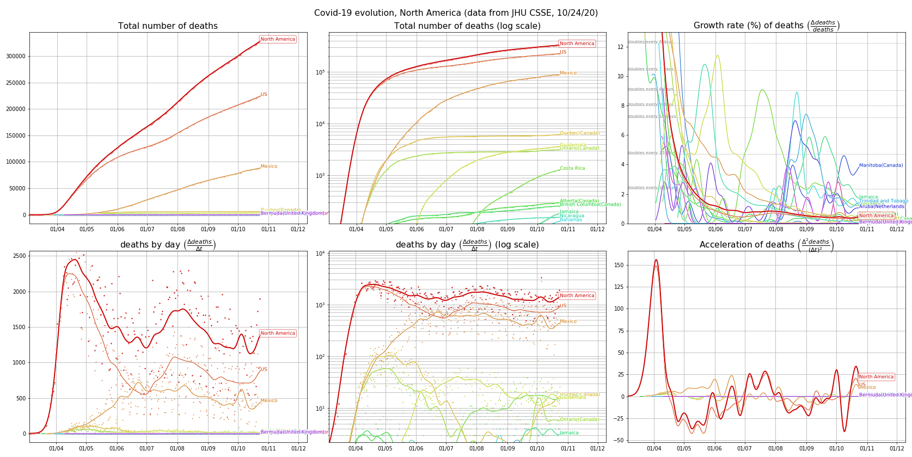](./fig/North_America_d_a.pdf)

### Deaths (normalized by population size) <a name="North_Americad_rel"> ([table of contents](#top))

[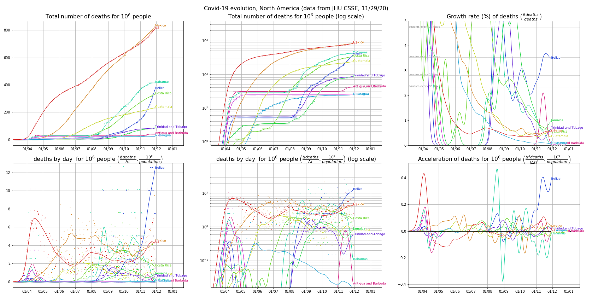](./fig/North_America_d_b.pdf)

### Confirmed cases (absolute values) <a name="North_Americac_abs"> ([table of contents](#top))

[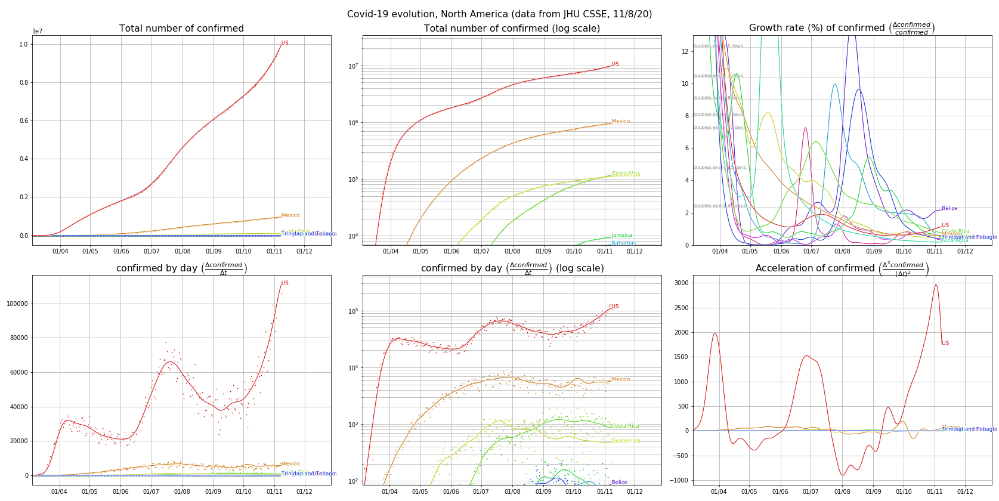](./fig/North_America_c_a.pdf)

### Confirmed cases (normalized by population size) <a name="North_Americac_rel"> ([table of contents](#top))

[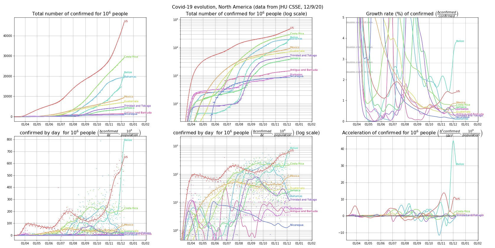](./fig/North_America_c_b.pdf)

### Recovered cases (absolute values) <a name="North_Americar_abs"> ([table of contents](#top))

[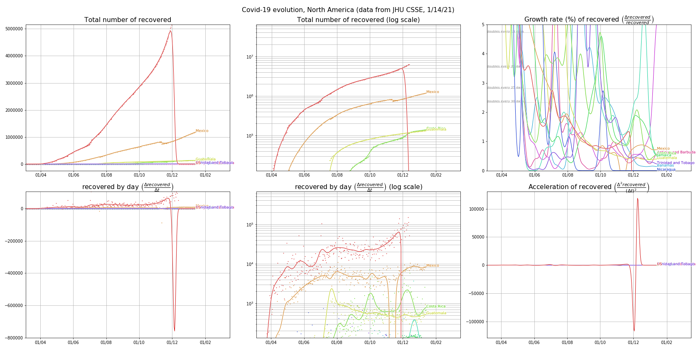](./fig/North_America_r_a.pdf)

### Recovered cases (normalized by population size) <a name="North_Americar_rel"> ([table of contents](#top))

[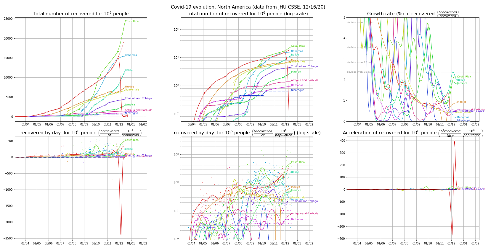](./fig/North_America_r_b.pdf)

- - - 

### United States<a name="United_States"> ([table of contents](#top))

- Deaths: [absolute values](#United_Statesd_abs), [normalized by population size](#United_Statesd_rel)  
- Confirmed cases: [absolute values](#United_Statesc_abs), [normalized by population size](#United_Statesc_rel)  

### Deaths (absolute values) <a name="United_Statesd_abs"> ([table of contents](#top))

[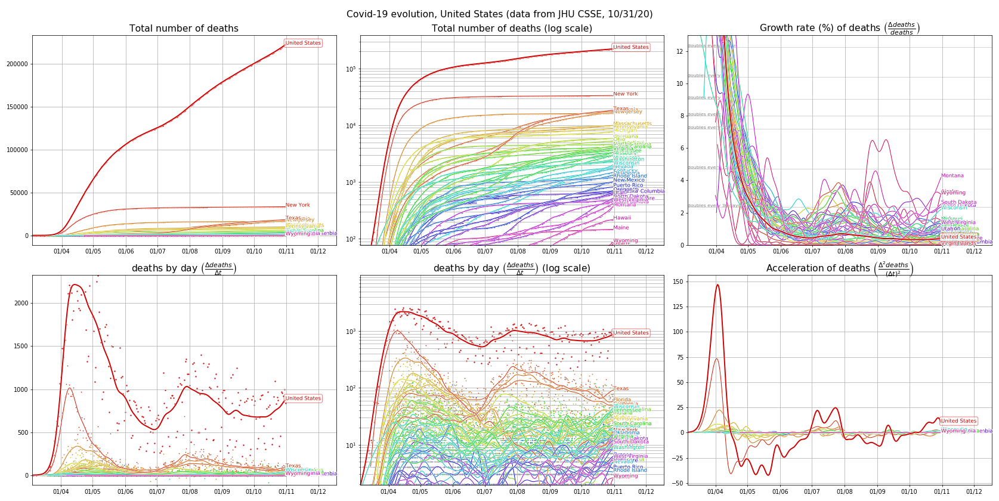](./fig/United_States_d_a.pdf)

### Deaths (normalized by population size) <a name="United_Statesd_rel"> ([table of contents](#top))

[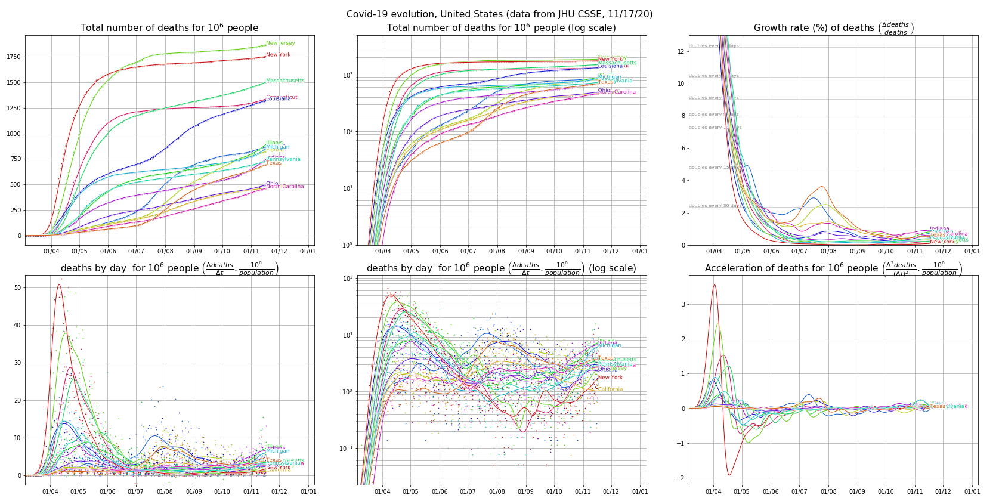](./fig/United_States_d_b.pdf)

### Confirmed cases (absolute values) <a name="United_Statesc_abs"> ([table of contents](#top))

[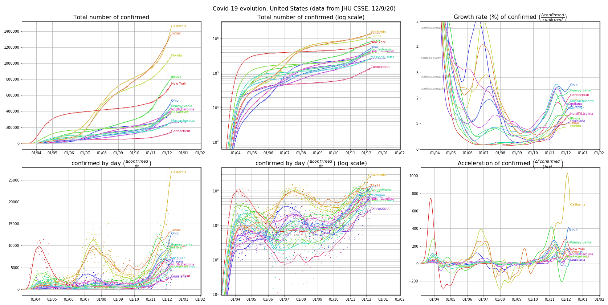](./fig/United_States_c_a.pdf)

### Confirmed cases (normalized by population size) <a name="United_Statesc_rel"> ([table of contents](#top))

[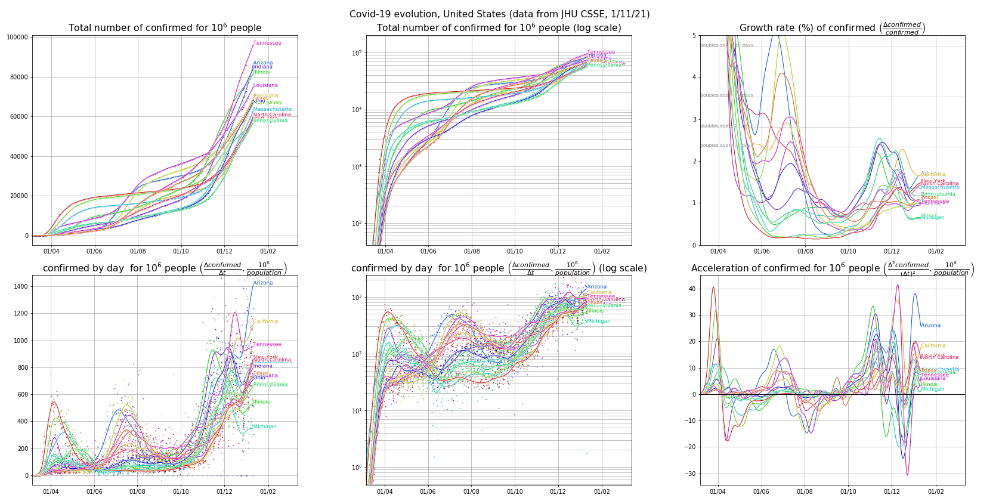](./fig/United_States_c_b.pdf)

- - - 

## South America<a name="South_America"> ([table of contents](#top))

- Deaths: [absolute values](#South_Americad_abs), [normalized by population size](#South_Americad_rel)  
- Confirmed cases: [absolute values](#South_Americac_abs), [normalized by population size](#South_Americac_rel)  
- Recovered cases: [absolute values](#South_Americar_abs), [normalized by population size](#South_Americar_rel)  

### Deaths (absolute values) <a name="South_Americad_abs"> ([table of contents](#top))

[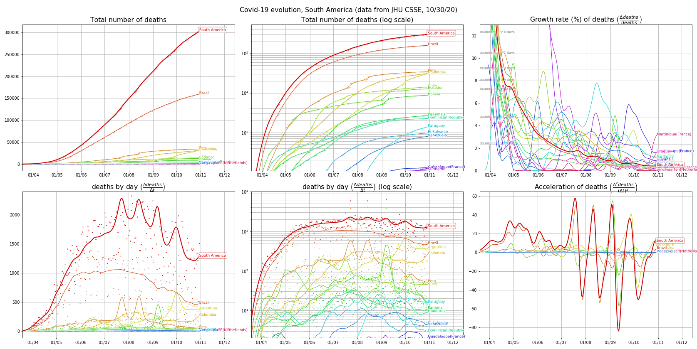](./fig/South_America_d_a.pdf)

[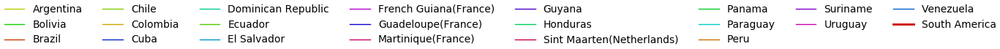](./fig/South_America_legend.pdf)

### Deaths (normalized by population size) <a name="South_Americad_rel"> ([table of contents](#top))

### Confirmed cases (absolute values) <a name="South_Americac_abs"> ([table of contents](#top))

[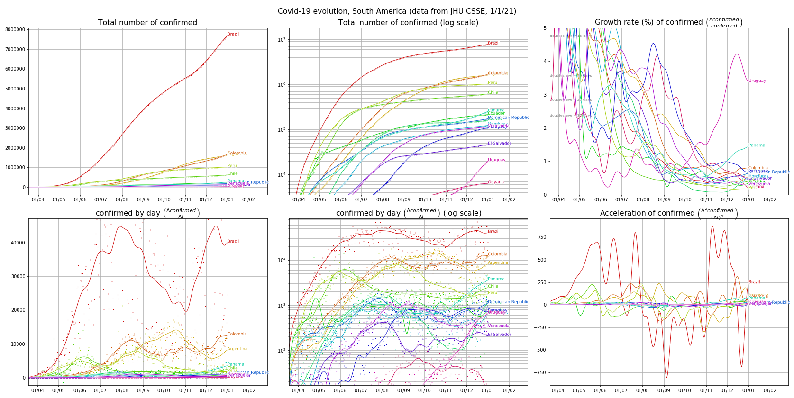](./fig/South_America_c_a.pdf)

### Confirmed cases (normalized by population size) <a name="South_Americac_rel"> ([table of contents](#top))

[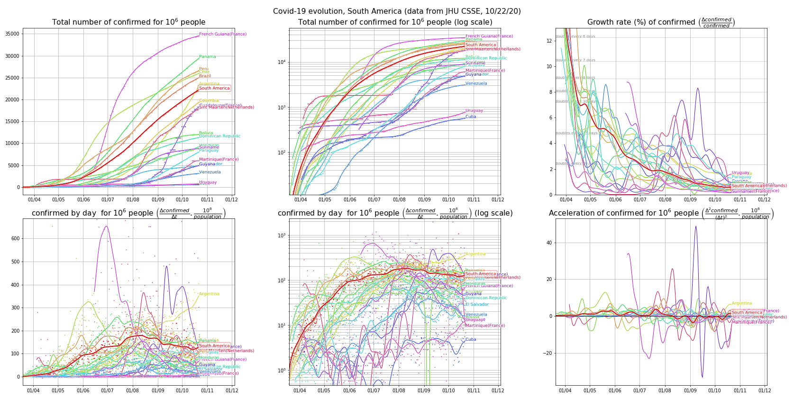](./fig/South_America_c_b.pdf)

### Recovered cases (absolute values) <a name="South_Americar_abs"> ([table of contents](#top))

[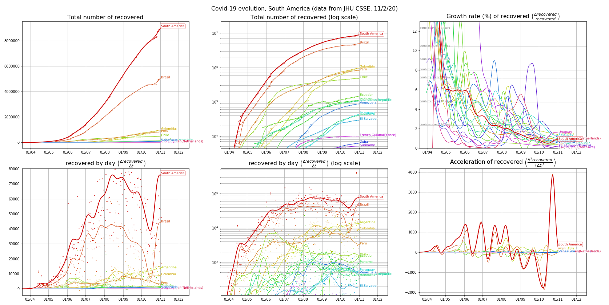](./fig/South_America_r_a.pdf)

### Recovered cases (normalized by population size) <a name="South_Americar_rel"> ([table of contents](#top))

[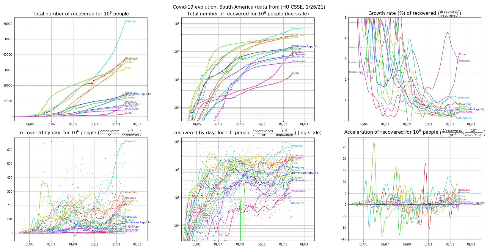](./fig/South_America_r_b.pdf)

- - - 

## Africa<a name="Africa"> ([table of contents](#top))

- Deaths: [absolute values](#Africad_abs), [normalized by population size](#Africad_rel)  
- Confirmed cases: [absolute values](#Africac_abs), [normalized by population size](#Africac_rel)  
- Recovered cases: [absolute values](#Africar_abs), [normalized by population size](#Africar_rel)  

### Deaths (absolute values) <a name="Africad_abs"> ([table of contents](#top))

[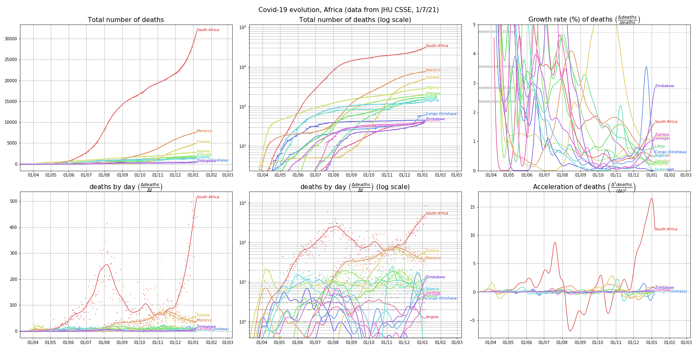](./fig/Africa_d_a.pdf)

[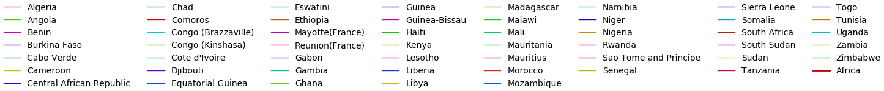](./fig/Africa_legend.pdf)

### Deaths (normalized by population size) <a name="Africad_rel"> ([table of contents](#top))

[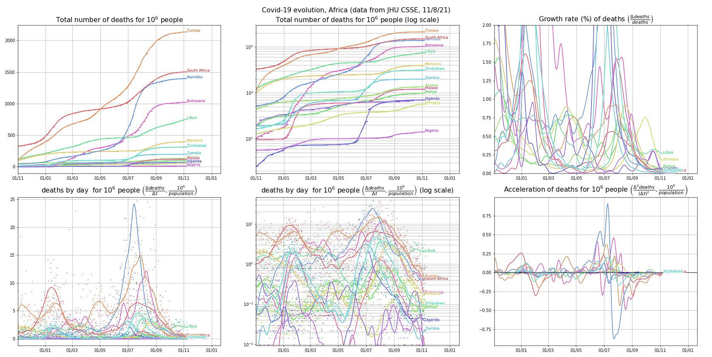](./fig/Africa_d_b.pdf)

### Confirmed cases (absolute values) <a name="Africac_abs"> ([table of contents](#top))

[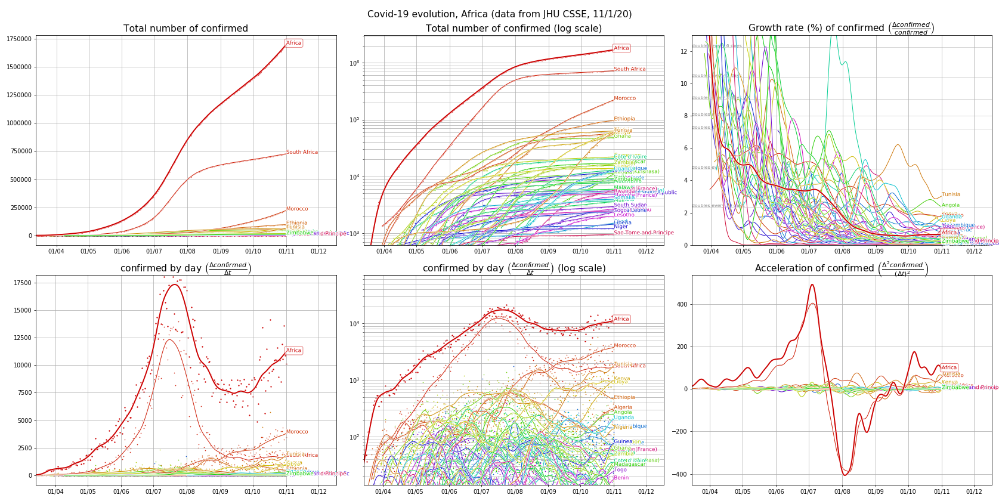](./fig/Africa_c_a.pdf)

### Confirmed cases (normalized by population size) <a name="Africac_rel"> ([table of contents](#top))

[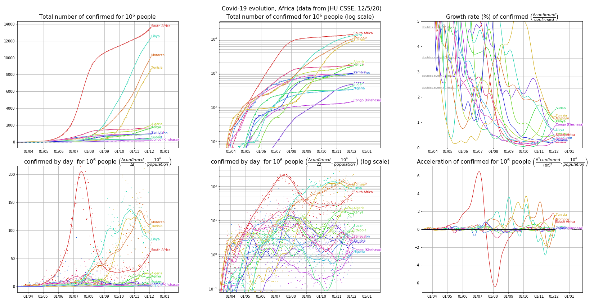](./fig/Africa_c_b.pdf)

### Recovered cases (absolute values) <a name="Africar_abs"> ([table of contents](#top))

[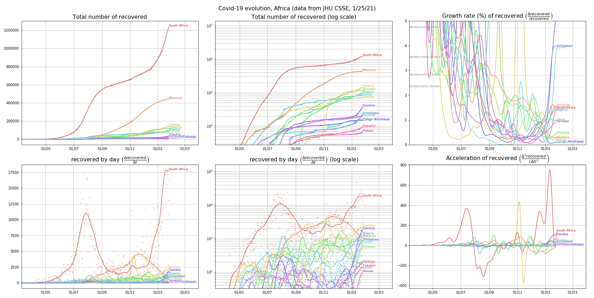](./fig/Africa_r_a.pdf)

### Recovered cases (normalized by population size) <a name="Africar_rel"> ([table of contents](#top))

[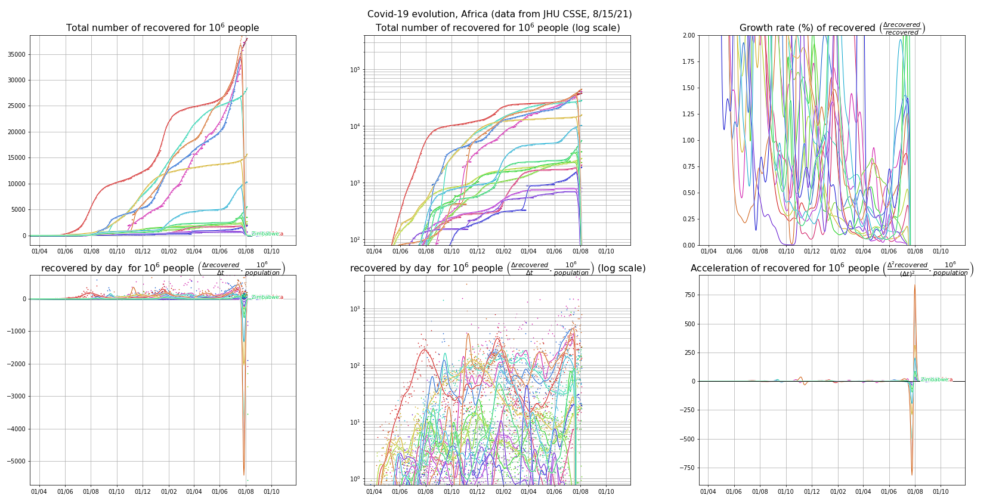](./fig/Africa_r_b.pdf)

- - - 

## Oceania<a name="Oceania"> ([table of contents](#top))

- Deaths: [absolute values](#Oceaniad_abs), [normalized by population size](#Oceaniad_rel)  
- Confirmed cases: [absolute values](#Oceaniac_abs), [normalized by population size](#Oceaniac_rel)  
- Recovered cases: [absolute values](#Oceaniar_abs), [normalized by population size](#Oceaniar_rel)  

### Deaths (absolute values) <a name="Oceaniad_abs"> ([table of contents](#top))

[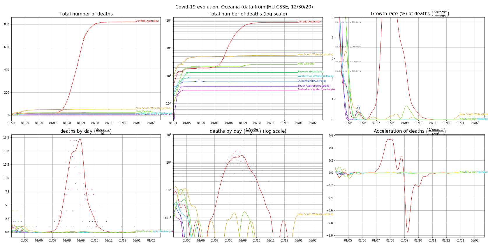](./fig/Oceania_d_a.pdf)

### Deaths (normalized by population size) <a name="Oceaniad_rel"> ([table of contents](#top))

[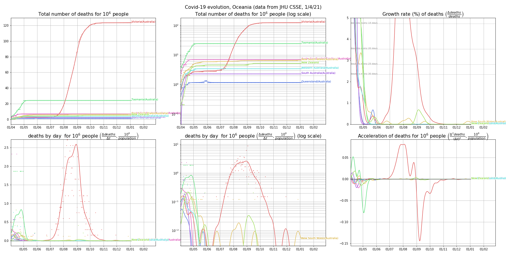](./fig/Oceania_d_b.pdf)

### Confirmed cases (absolute values) <a name="Oceaniac_abs"> ([table of contents](#top))

[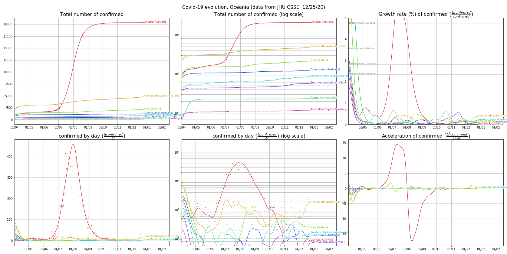](./fig/Oceania_c_a.pdf)

### Confirmed cases (normalized by population size) <a name="Oceaniac_rel"> ([table of contents](#top))

[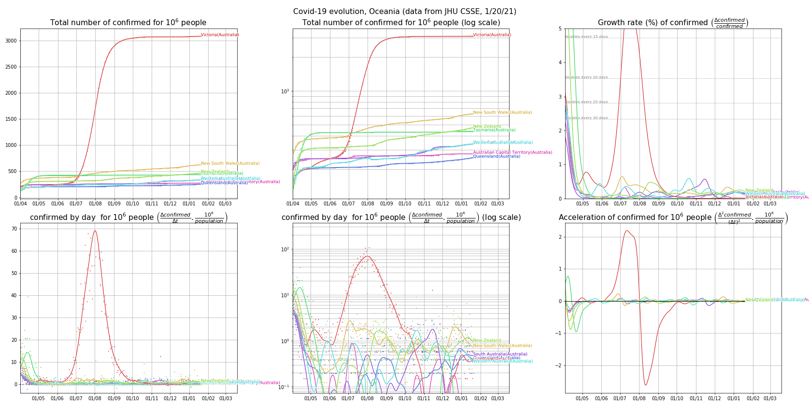](./fig/Oceania_c_b.pdf)

### Recovered cases (absolute values) <a name="Oceaniar_abs"> ([table of contents](#top))

[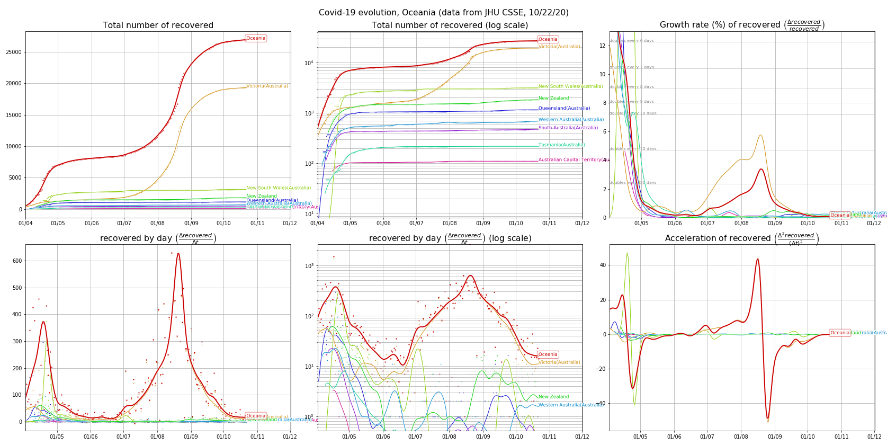](./fig/Oceania_r_a.pdf)

### Recovered cases (normalized by population size) <a name="Oceaniar_rel"> ([table of contents](#top))

[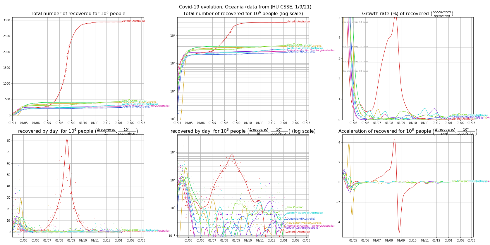](./fig/Oceania_r_b.pdf)

- - - 

## 15 countries with the most deaths<a name="top15"> ([table of contents](#top))

- Deaths: [absolute values](#top15d_abs), [normalized by population size](#top15d_rel)  
- Confirmed cases: [absolute values](#top15c_abs), [normalized by population size](#top15c_rel)  
- Recovered cases: [absolute values](#top15r_abs), [normalized by population size](#top15r_rel)  

### Deaths (absolute values) <a name="top15d_abs"> ([table of contents](#top))

[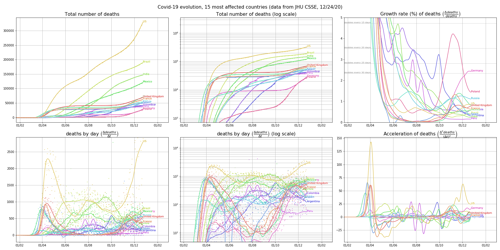](./fig/top15_d_a.pdf)

[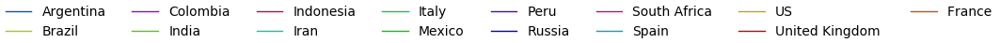](./fig/top15_legend.pdf)

### Deaths (normalized by population size) <a name="top15d_rel"> ([table of contents](#top))

[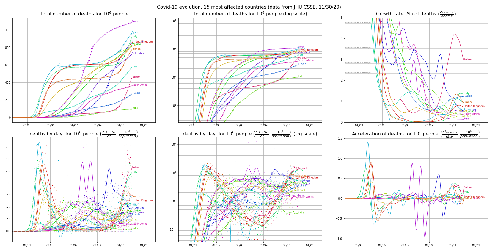](./fig/top15_d_b.pdf)

### Confirmed cases (absolute values) <a name="top15c_abs"> ([table of contents](#top))

[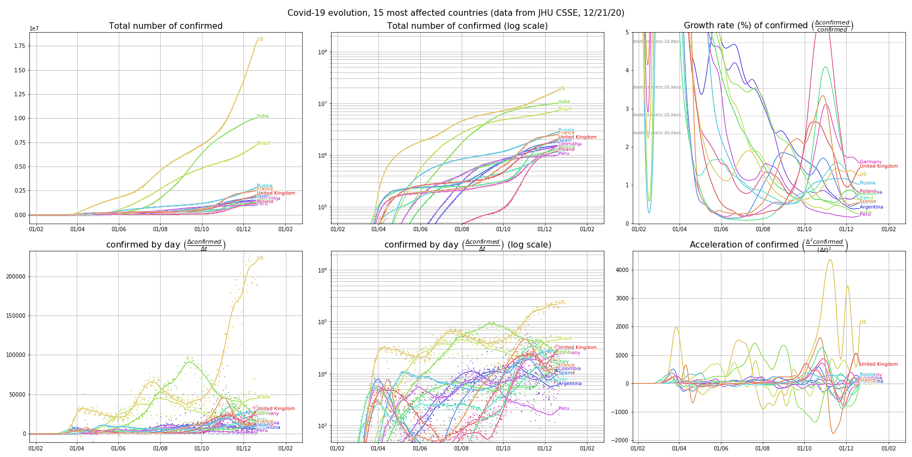](./fig/top15_c_a.pdf)

### Confirmed cases (normalized by population size) <a name="top15c_rel"> ([table of contents](#top))

[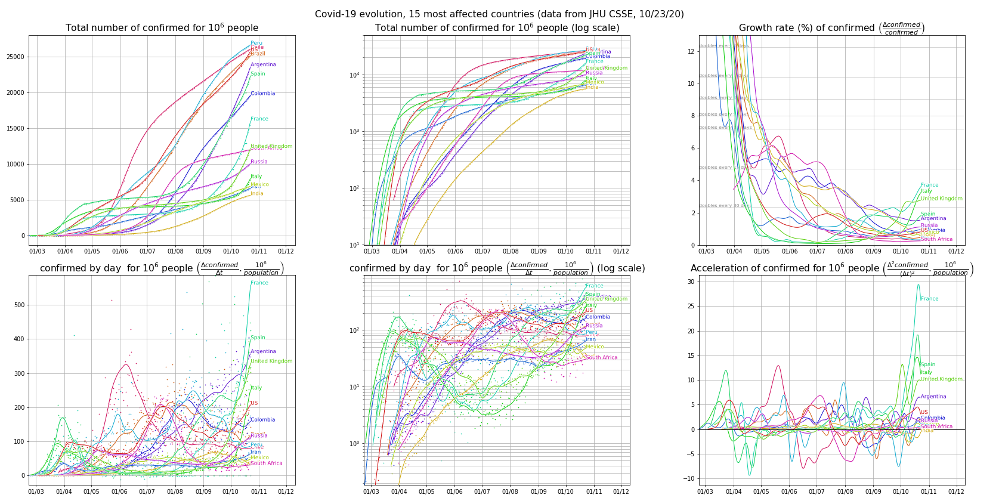](./fig/top15_c_b.pdf)

### Recovered cases (absolute values) <a name="top15r_abs"> ([table of contents](#top))

[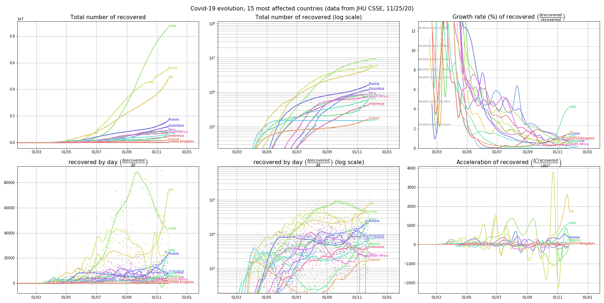](./fig/top15_r_a.pdf)

### Recovered cases (normalized by population size) <a name="top15r_rel"> ([table of contents](#top))

[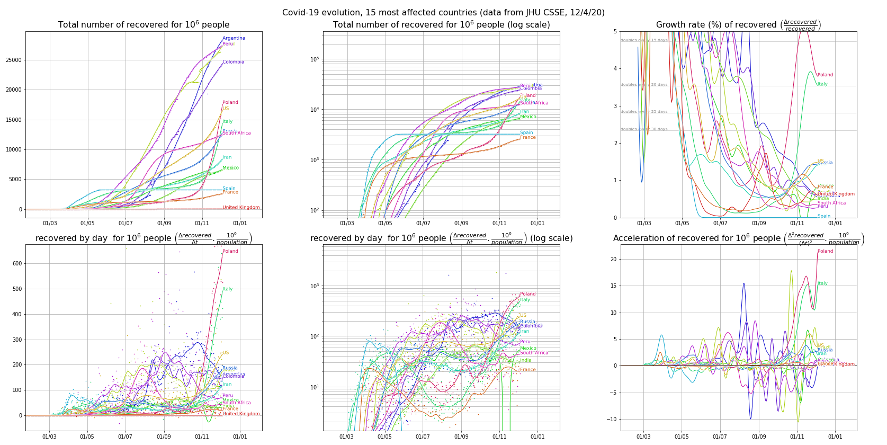](./fig/top15_r_b.pdf)

